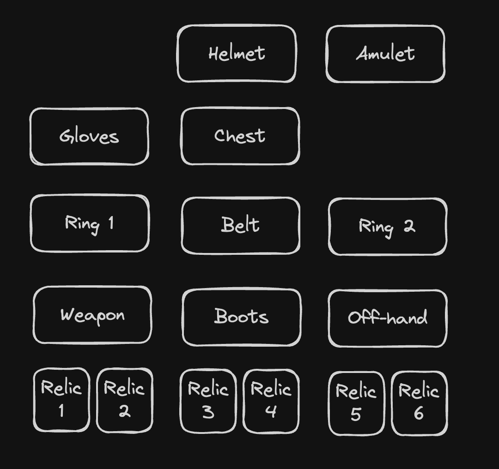

### Inventory slots

-  Helmet
-  Chest
-  Belt
-  Boots
-  Gloves
-  Amulet
-  Ring 1
-  Ring 2

-  Weapon
-  Off-hand

-  Relic 1
-  Relic 2
-  Relic 3
-  Relic 4
-  Relic 5
-  Relic 6

### Equipments types

-  Helmet
   -  Helmet (health)
      -  Required level 1, +2 to +3 to maximum health
      -  Required level 7, +8 to +10 to maximum health
      -  Required level 12, +14 to +17 to maximum health
      -  Required level 18, +21 to +25 to maximum health
   -  Helmet (magic shield)
      -  Required level 3, +2 to +4 to maximum magic shield
      -  Required level 8, +9 to +12 to maximum magic shield
      -  Required level 13, +15 to +19 to maximum magic shield
      -  Required level 19, +22 to +27 to maximum magic shield
   -  Helmet (evasion)
      -  Required level 3, +5 to +8 to maximum evasion
      -  Required level 8, +13 to +17 to maximum evasion
      -  Required level 13, +21 to +26 to maximum evasion
      -  Required level 19, +30 to +36 to maximum evasion
   -  Helmet (health / magic shield)
      -  Required level 3, +2 to +3 to maximum health and magic shield
      -  Required level 8, +5 to +8 to maximum health and magic shield
      -  Required level 13, +9 to +12 to maximum health and magic shield
      -  Required level 19, +14 to +18 to maximum health and magic shield
   -  Helmet (health / evasion)
      -  Required level 3, +3 to +4 to maximum health and evasion
      -  Required level 8, +8 to +13 to maximum health and evasion
      -  Required level 13, +15 to +19 to maximum health and evasion
      -  Required level 19, +22 to +26 to maximum health and evasion
   -  Helmet (magic shield / evasion)
      -  Required level 3, +2 to +4 to maximum magic shield and evasion
      -  Required level 8, +7 to +10 to maximum magic shield and evasion
      -  Required level 13, +12 to +16 to maximum magic shield and evasion
      -  Required level 19, +18 to +23 to maximum magic shield and evasion
-  Chest
   -  Chest (health)
      -  Required level 1, +5 to +7 to maximum health
      -  Required level 7, +15 to +18 to maximum health
      -  Required level 12, +25 to +29 to maximum health
      -  Required level 18, +35 to +40 to maximum health
   -  Chest (magic shield)
      -  Required level 3, +5 to +9 to maximum magic shield
      -  Required level 8, +15 to +20 to maximum magic shield
      -  Required level 13, +25 to +31 to maximum magic shield
      -  Required level 19, +35 to +42 to maximum magic shield
   -  Chest (evasion)
      -  Required level 3, +10 to +16 to maximum evasion
      -  Required level 8, +20 to +27 to maximum evasion
      -  Required level 13, +30 to +38 to maximum evasion
      -  Required level 19, +40 to +49 to maximum evasion
   -  Chest (health / magic shield)
      -  Required level 3, +3 to +5 to maximum health and magic shield
      -  Required level 8, +8 to +12 to maximum health and magic shield
      -  Required level 13, +14 to +19 to maximum health and magic shield
      -  Required level 19, +21 to +27 to maximum health and magic shield
   -  Chest (health / evasion)
      -  Required level 3, +4 to +6 to maximum health and evasion
      -  Required level 8, +10 to +15 to maximum health and evasion
      -  Required level 13, +17 to +22 to maximum health and evasion
      -  Required level 19, +24 to +30 to maximum health and evasion
   -  Chest (magic shield / evasion)
      -  Required level 3, +3 to +5 to maximum magic shield and evasion
      -  Required level 8, +9 to +13 to maximum magic shield and evasion
      -  Required level 13, +16 to +21 to maximum magic shield and evasion
      -  Required level 19, +23 to +29 to maximum magic shield and evasion
-  Boots
   -  Boots (health)
      -  Required level 1, +1 to +2 to maximum health
      -  Required level 7, +4 to +6 to maximum health
      -  Required level 12, +7 to +9 to maximum health
      -  Required level 18, +10 to +12 to maximum health
   -  Boots (magic shield)
      -  Required level 3, +1 to +2 to maximum magic shield
      -  Required level 8, +4 to +5 to maximum magic shield
      -  Required level 13, +7 to +8 to maximum magic shield
      -  Required level 19, +10 to +11 to maximum magic shield
   -  Boots (evasion)
      -  Required level 3, +3 to +4 to maximum evasion
      -  Required level 8, +6 to +7 to maximum evasion
      -  Required level 13, +9 to +10 to maximum evasion
      -  Required level 19, +12 to +13 to maximum evasion
   -  Boots (health / magic shield)
      -  Required level 3, +1 to +2 to maximum health and magic shield
      -  Required level 8, +3 to +4 to maximum health and magic shield
      -  Required level 13, +5 to +6 to maximum health and magic shield
      -  Required level 19, +7 to +8 to maximum health and magic shield
   -  Boots (health / evasion)
      -  Required level 3, +2 to +3 to maximum health and evasion
      -  Required level 8, +4 to +5 to maximum health and evasion
      -  Required level 13, +6 to +7 to maximum health and evasion
      -  Required level 19, +8 to +9 to maximum health and evasion
   -  Boots (magic shield / evasion)
      -  Required level 3, +1 to +2 to maximum magic shield and evasion
      -  Required level 8, +3 to +4 to maximum magic shield and evasion
      -  Required level 13, +5 to +6 to maximum magic shield and evasion
      -  Required level 19, +7 to +8 to maximum magic shield and evasion
-  Gloves
   -  Gloves (health)
      -  Required level 1, +1 to +2 to maximum health
      -  Required level 7, +4 to +6 to maximum health
      -  Required level 12, +7 to +9 to maximum health
      -  Required level 18, +10 to +12 to maximum health
   -  Gloves (magic shield)
      -  Required level 3, +1 to +2 to maximum magic shield
      -  Required level 8, +4 to +5 to maximum magic shield
      -  Required level 13, +7 to +8 to maximum magic shield
      -  Required level 19, +10 to +11 to maximum magic shield
   -  Gloves (evasion)
      -  Required level 3, +3 to +4 to maximum evasion
      -  Required level 8, +6 to +7 to maximum evasion
      -  Required level 13, +9 to +10 to maximum evasion
      -  Required level 19, +12 to +13 to maximum evasion
   -  Gloves (health / magic shield)
      -  Required level 3, +1 to +2 to maximum health and magic shield
      -  Required level 8, +3 to +4 to maximum health and magic shield
      -  Required level 13, +5 to +6 to maximum health and magic shield
      -  Required level 19, +7 to +8 to maximum health and magic shield
   -  Gloves (health / evasion)
      -  Required level 3, +2 to +3 to maximum health and evasion
      -  Required level 8, +4 to +5 to maximum health and evasion
      -  Required level 13, +6 to +7 to maximum health and evasion
      -  Required level 19, +8 to +9 to maximum health and evasion
   -  Gloves (magic shield / evasion)
      -  Required level 3, +1 to +2 to maximum magic shield and evasion
      -  Required level 8, +3 to +4 to maximum magic shield and evasion
      -  Required level 13, +5 to +6 to maximum magic shield and evasion
      -  Required level 19, +7 to +8 to maximum magic shield and evasion
-  Amulet
   -  Amulet (health)
      -  Required level 1, +1 to +2 to maximum health
      -  Required level 7, +4 to +6 to maximum health
      -  Required level 12, +7 to +9 to maximum health
      -  Required level 18, +10 to +12 to maximum health
   -  Amulet (prospect)
      -  Required level 3, +1 to +2 to prospect
      -  Required level 8, +3 to +4 to prospect
      -  Required level 13, +5 to +6 to prospect
      -  Required level 19, +7 to +8 to prospect
   -  Amulet (strength)
      -  Required level 3, +1 to +2 to strength
      -  Required level 8, +3 to +4 to strength
      -  Required level 13, +5 to +6 to strength
      -  Required level 19, +7 to +8 to strength
   -  Amulet (spirit)
      -  Required level 3, +1 to +2 to spirit
      -  Required level 8, +3 to +4 to spirit
      -  Required level 13, +5 to +6 to spirit
      -  Required level 19, +7 to +8 to spirit
   -  Amulet (dexterity)
      -  Required level 3, +1 to +2 to dexterity
      -  Required level 8, +3 to +4 to dexterity
      -  Required level 13, +5 to +6 to dexterity
      -  Required level 19, +7 to +8 to dexterity
   -  Amulet (luck)
      -  Required level 3, +1 to +2 to luck
      -  Required level 8, +3 to +4 to luck
      -  Required level 13, +5 to +6 to luck
      -  Required level 19, +7 to +8 to luck
   -  Amulet (**\#**% earth resistance)
      -  Required level 3, +1% to +2% earth resistance
      -  Required level 8, +3% to +4% earth resistance
      -  Required level 13, +5% to +6% earth resistance
      -  Required level 19, +7% to +8% earth resistance
   -  Amulet (**\#**% fire resistance)
      -  Required level 3, +1% to +2% fire resistance
      -  Required level 8, +3% to +4% fire resistance
      -  Required level 13, +5% to +6% fire resistance
      -  Required level 19, +7% to +8% fire resistance
   -  Amulet (**\#**% wind resistance)
      -  Required level 3, +1% to +2% wind resistance
      -  Required level 8, +3% to +4% wind resistance
      -  Required level 13, +5% to +6% wind resistance
      -  Required level 19, +7% to +8% wind resistance
   -  Amulet (**\#**% ice resistance)
      -  Required level 3, +1% to +2% ice resistance
      -  Required level 8, +3% to +4% ice resistance
      -  Required level 13, +5% to +6% ice resistance
      -  Required level 19, +7% to +8% ice resistance
   -  Amulet (**\#**% to all elemental resistances)
      -  Required level 3, +1% to +2% to all elemental resistances
      -  Required level 8, +2% to +3% to all elemental resistances
      -  Required level 13, +3% to +5% to all elemental resistances
      -  Required level 19, +5% to +6% to all elemental resistances
   -  Amulet (**\#**% increased critical strike chance)
      -  Required level 3, +1% to +3% increased critical strike chance
      -  Required level 8, +3% to +5% increased critical strike chance
      -  Required level 13, +5% to +7% increased critical strike chance
      -  Required level 19, +8% to +11% increased critical strike chance
-  Ring
   -  Ring (health)
      -  Required level 1, +1 to +2 to maximum health
      -  Required level 7, +4 to +6 to maximum health
      -  Required level 12, +7 to +9 to maximum health
      -  Required level 18, +10 to +12 to maximum health
   -  Ring (prospect)
      -  Required level 3, +1 to +2 to prospect
      -  Required level 8, +3 to +4 to prospect
      -  Required level 13, +5 to +6 to prospect
      -  Required level 19, +7 to +8 to prospect
   -  Ring (strength)
      -  Required level 3, +1 to +2 to strength
      -  Required level 8, +3 to +4 to strength
      -  Required level 13, +5 to +6 to strength
      -  Required level 19, +7 to +8 to strength
   -  Ring (spirit)
      -  Required level 3, +1 to +2 to spirit
      -  Required level 8, +3 to +4 to spirit
      -  Required level 13, +5 to +6 to spirit
      -  Required level 19, +7 to +8 to spirit
   -  Ring (dexterity)
      -  Required level 3, +1 to +2 to dexterity
      -  Required level 8, +3 to +4 to dexterity
      -  Required level 13, +5 to +6 to dexterity
      -  Required level 19, +7 to +8 to dexterity
   -  Ring (luck)
      -  Required level 3, +1 to +2 to luck
      -  Required level 8, +3 to +4 to luck
      -  Required level 13, +5 to +6 to luck
      -  Required level 19, +7 to +8 to luck
   -  Ring (**\#**% earth resistance)
      -  Required level 3, +1% to +2% earth resistance
      -  Required level 8, +3% to +4% earth resistance
      -  Required level 13, +5% to +6% earth resistance
      -  Required level 19, +7% to +8% earth resistance
   -  Ring (**\#**% fire resistance)
      -  Required level 3, +1% to +2% fire resistance
      -  Required level 8, +3% to +4% fire resistance
      -  Required level 13, +5% to +6% fire resistance
      -  Required level 19, +7% to +8% fire resistance
   -  Ring (**\#**% wind resistance)
      -  Required level 3, +1% to +2% wind resistance
      -  Required level 8, +3% to +4% wind resistance
      -  Required level 13, +5% to +6% wind resistance
      -  Required level 19, +7% to +8% wind resistance
   -  Ring (**\#**% ice resistance)
      -  Required level 3, +1% to +2% ice resistance
      -  Required level 8, +3% to +4% ice resistance
      -  Required level 13, +5% to +6% ice resistance
      -  Required level 19, +7% to +8% ice resistance
   -  Ring (**\#**% to all elemental resistances)
      -  Required level 3, +1% to +2% to all elemental resistances
      -  Required level 8, +2% to +3% to all elemental resistances
      -  Required level 13, +3% to +5% to all elemental resistances
      -  Required level 19, +5% to +6% to all elemental resistances
   -  Ring (**\#**% increased critical strike chance)
      -  Required level 3, +1% to +3% increased critical strike chance
      -  Required level 8, +3% to +5% increased critical strike chance
      -  Required level 13, +5% to +7% increased critical strike chance
      -  Required level 19, +8% to +11% increased critical strike chance
-  Weapon
   -  Sword (1H)
      -  Required level 1, +20 to +40 precision, 4 to 10 damages
      -  Required level 7, +60 to +80 precision, 12 to 20 damages
      -  Required level 12, +100 to +120 precision, 22 to 30 damages
      -  Required level 18, +140 to +160 precision, 32 to 40 damages
   -  Axe (1H)
      -  Required level 1, 5 to 12 damages
      -  Required level 7, 14 to 23 damages
      -  Required level 12, 25 to 34 damages
      -  Required level 18, 36 to 44 damages
   -  Mace (1H)
      -  Required level 1, +1% to +2% increased elemental damages, 4 to 10 damages
      -  Required level 7, +3% to +5% increased elemental damages, 12 to 20 damages
      -  Required level 12, +7% to +12% increased elemental damages, 22 to 30 damages
      -  Required level 18, +14% to +17% increased elemental damages, 32 to 40 damages
   -  Dagger (1H)
      -  Required level 1, +1% to +2% increased critical strike chance, 2 to 5 damages
      -  Required level 7, +3% to +5% increased critical strike chance, 6 to 10 damages
      -  Required level 12, +7% to +12% increased critical strike chance, 11 to 15 damages
      -  Required level 18, +14% to +17% increased critical strike chance, 16 to 20 damages
   -  Wand (1H)
      -  Required level 1, +2% to +3% increased **_element_** damages, 3 to 9 damages
      -  Required level 7, +4% to +7% increased **_element_** damages, 10 to 19 damages
      -  Required level 12, +10% to +16% increased **_element_** damages, 20 to 29 damages
      -  Required level 18, +17% to +23% increased **_element_** damages, 30 to 39 damages
   -  Sword (2H)
      -  Required level 1, +35 to +70 precision, 7 to 17 damages
      -  Required level 7, +105 to +140 precision, 21 to 35 damages
      -  Required level 12, +175 to +210 precision, 38 to 52 damages
      -  Required level 18, +245 to +280 precision, 56 to 70 damages
   -  Axe (2H) (increase damages)
      -  Required level 1, 9 to 21 damages
      -  Required level 7, 25 to 41 damages
      -  Required level 12, 44 to 59 damages
      -  Required level 18, 63 to 77 damages
   -  Mace (2H)
      -  Required level 1, +2% to +4% increased elemental damages, 7 to 17 damages
      -  Required level 7, +6% to +10% increased elemental damages, 21 to 35 damages
      -  Required level 12, +14% to +24% increased elemental damages, 38 to 52 damages
      -  Required level 18, +28% to +34% increased elemental damages, 56 to 70 damages
   -  Bow (2H)
      -  Required level 1, +10% to +20% critical strike damage multiplier, 5 to 12 damages
      -  Required level 7, +25% to +35% critical strike damage multiplier, 14 to 23 damages
      -  Required level 12, +40% to +50% critical strike damage multiplier, 25 to 34 damages
      -  Required level 18, +55% to +70% critical strike damage multiplier, 36 to 44 damages
   -  Staff (2H)
      -  Required level 1, +2% to +4% increased **_element_** damages, 5 to 15 damages
      -  Required level 7, +6% to +10% increased **_element_** damages, 16 to 30 damages
      -  Required level 12, +14% to +24% increased **_element_** damages, 31 to 45 damages
      -  Required level 18, +28% to +34% increased **_element_** damages, 46 to 60 damages
-  Off-hand
   -  Shield (needs a 1H weapon)
      -  Required level 1, +5 to +10 to maximum health, +5 to +10 to maximum magic shield
      -  Required level 7, +15 to +20 to maximum health, +15 to +20 to maximum magic shield
      -  Required level 12, +25 to +30 to maximum health, +25 to +30 to maximum magic shield
      -  Required level 18, +35 to +40 to maximum health, +35 to +40 to maximum magic shield
   -  Tome (needs a wand)
      -  Required level 1, +2% to +3% increased wand damages
      -  Required level 7, +4% to +7% increased wand damages
      -  Required level 12, +10% to +16% increased wand damages
      -  Required level 18, +17% to +23% increased wand damages
   -  Quiver (needs a bow)
      -  Required level 1, +2% to +3% increased bow damages
      -  Required level 7, +4% to +7% increased bow damages
      -  Required level 12, +10% to +16% increased bow damages
      -  Required level 18, +17% to +23% increased bow damages
-  Relic
   -  Dice
      -  **Lucky dice**: Required level 10, -30 to +30 prospect
      -  **Striking dice**: Required level 10, -20 to +20 critical strike chance
      -  **Leader dice**: Required level 10, +1 to +1000 initiative
   -  Alcohol
      -  **Pietro bottle**: Required level 5, -100 to +100 precision
      -  **Champagne bottle**: Required level 10, -100 to +250 precision
      -  **Strong can**: Required level 5, -196 to +196 evasion
   -  Orb
      -  **Earth orb**: Required level 5, +1% to +5% earth resistance
      -  **Fire orb**: Required level 5, +1% to +5% fire resistance
      -  **Wind orb**: Required level 5, +1% to +5% wind resistance
      -  **Ice orb**: Required level 5, +1% to +5% ice resistance
   -  Joker card
      -  Specific fight mechanic
      -  Allocates a specific talent point
